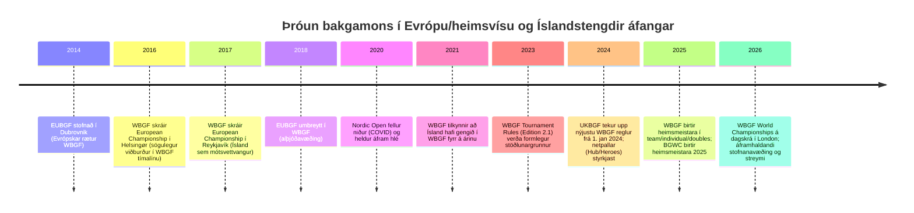

# Bakgamon á heimsvísu, í Evrópu og á Íslandi

## Samantekt fyrir stjórnendur

Bakgamon er í dag samtímis hefðbundin borðíþrótt og mjög stafrænt keppnisvistkerfi. Alþjóðlega séð gegnir World Backgammon Federation (WBGF) hlutverki alþjóðlegs reglu- og mótaramma: sambandið skilgreinir markmið um alþjóðlega staðla, siðareglur og mótahald, rekur opinbera niðurstöðu- og stigagrunna (WBGF Results) og heldur úti heimsmeistaraeinvígjum/heimsmótum í nokkrum flokkum (lið, kvennalið, einstaklings, tvímenning o.fl.). citeturn53view0turn48search15turn44view0

Á sama tíma er “heimsmeistaratitill” í bakgamoni ekki eins einfaldur og í mörgum öðrum hugaríþróttum: Monte Carlo–miðaða Backgammon World Championship (BGWC) mótar “sögulega” línu heimsmeistara (Monaco/Monte Carlo) og er sýnilegt sem sér kerfi (með eigin vef, beinum útsendingum og sögulegum vinningslistum). Vefur BGWC tilgreinir núverandi heimsmeistara (t.d. 2025) og sýnir að mótahald og fjölmiðlun er tengd stórum stafrænum aðilum (Backgammon Galaxy/streymi). citeturn35view0turn50search7turn37view0

Evrópska víddin hefur tvíþættan kjarna: annars vegar WBGF (sem varð til úr European Backgammon Federation, EUBGF, stofnað 2014 í Dubrovnik og breytt í WBGF 2018) og hins vegar sterk landsambönd/landsdeildir (t.d. UKBGF, DBgF o.fl.) sem reka eigin stigakerfi, mótaraðir og streymi. citeturn53view0turn30search9turn16search6

Stigagjöf og “hver er bestur” skiptist í nokkur kerfi sem mæla ólík fyrirbæri. WBGF birtir heimslista byggðan á “World Rank Points” (ásamt “activity”) og birtir einnig landsröðun eftir samanlögðum stigum. citeturn11search7turn12search11 BMAB (Backgammon Masters Awarding Body) veitir titla og birtir tölfræði byggða á staðfestum mótaleikjum með vélarúttekt (PR – performance rating, og einnig Elo-tengd tölfræði), og lýsir ferli þar sem myndbönd/afrit eru send inn, greind og birt. citeturn14search3turn15search6 Auk þess eru lands- og netþjónakerfi (UKBGF, FIBS/Heroes o.fl.) byggð á Elo-líkum einkunnum sem henta best til að meta árangur innan tiltekinna samfélaga/palla. citeturn15search0turn11search2turn30search13

Síðustu 5–10 ár einkennast af fjórum meginstraumum: (1) stöðlun reglna og aukin áhersla á ágreiningsferla, siðferði og rafræna aðstoð/streymi í mótum (WBGF Tournament Rules og upptaka þeirra af stórum landsamböndum), (2) hröð tilfærsla í netspilun og vef-vettvanga (Heroes, Galaxy, Hub) með virkri mótastýringu og upptökum, (3) AI/greiningarhugbúnaður verður “grunninnviður” þjálfunar og útsendinga, og (4) vaxandi efnisgerð/streymi (YouTube/Twitch) sem hluti af keppnismenningu. citeturn23view1turn23view2turn55view0turn30search0turn34search15turn33search12

Íslenskt bakgamon (kotra) birtist í opinberum alþjóðlegum kerfum á þrjá vegu: sem aðild í WBGF (Iceland tilgreint meðal aðildarfélaga og Ísland nefnt sem nýr aðili 2021), sem mót/viðburðir tengdir Reykjavík Open (skipulag af “Icelandic Backgammon Association”) og sem þátttaka í evrópskri keppni og stjórnun (t.d. 2014 landslið/EM í Dubrovnik og stjórnarsæti í evrópsku sambandi samkvæmt fjölmiðlum). citeturn49view0turn48search1turn42search6turn53view0 Mikilvægur varnagla er þó að hluti íslenskra heimilda um kotru er torlesinn í þessari rannsóknarumhverfisuppsetningu (403-lokanir), þannig að klúbba- og leikmannaskráning getur verið ófullkomin í þessari samantekt. citeturn42search1turn42search13

## Umhverfi, samtök og stjórnskipulag

WBGF skilgreinir sig sem alþjóðlegt stjórnvald bakgamons, skráð sem óhagnaðardrifið félag í Austurríki, pólitískt og trúarlega hlutlaust, með markmið um stöðlun reglna, opinber stigakerfi, siðferði og alþjóðleg mót. Á “About” síðu WBGF er jafnframt skýr þróunarlína: EUBGF stofnað 2014 í Dubrovnik og umbreytt í WBGF 2018. citeturn53view0 Sama heimild sýnir líka að mótasaga WBGF nær yfir “European Championship” ár (2014–2017) þar sem 2017 er merkt Reykjavík, Ísland, sem vettvangur Evrópumeistaramóts. citeturn53view0

Net- og titlakerfin sem WBGF vísar formlega í (á “Ratings” hluta) eru þrjú: WBGF Results (opinber stig/niðurstöður), BMAB (titlar og PR/Elo úttekt) og WBIF (internet-mót). Þetta er mikilvægt því það sýnir að í nútíma bakgamoni eru “stjórnsýsla”, “stig” og “netkeppni” samofin og WBGF stillir sér upp sem reglu- og samræmingarmiðju á milli ólíkra keppnisheima. citeturn18view0turn53view0turn48search15

Í Evrópu eru landsambönd sérstaklega sterk. UKBGF er dæmi um landsamband sem (a) sér um stór mót (UK Open, UK Clubs Championship), (b) rekur mótaröð (UKBGF Tour) og (c) byggir upp eigin gagnainnviði: ratings vef, viðburðadagatal og opinber streymirás (Twitch/YouTube). citeturn30search9turn31search1turn31search9 Á Norðurlöndum er DBgF (danskt samband) dæmi um landsamband sem rekur sögulega sterkt alþjóðamót (Nordic Open), skilgreinir reglur og hefur stofnanalegt samþykki móta. citeturn16search6turn16search2

Samhliða WBGF/WBIF/BMAB eru einnig til mótahaldarar með eigin “circuit” eða vörumerki. Þar vegur WBF (wbf.net) þungt sem skipuleggjandi á European Backgammon Championship og stórmótum eins og Merit Open. WBF lýsir t.d. Merit Open sem stórum árlegum viðburði með háum gæðastaðli og “að jafnaði” um 50 þjóðfána/þjóðarfulltrúa, og setur fram “Golden Circuit” sem röð móta. citeturn54view0 Þetta er ekki sama og WBGF (stjórnsýsla/reglur), en hefur áhrif á hvernig “alþjóðlega toppsviðið” myndast í reynd.

### Samanburðartafla helstu samtaka og opinberra rekjanlegra vefja

| Svið | Samtök / kerfi | Hlutverk í vistkerfi | Opinber vefur fyrir mót / lista | Athugasemd um mælingu og áhrif | Heimild (URL) |
|---|---|---|---|---|---|
| Alþjóðlegt | WBGF | Alþjóðleg reglu- og mótarammi; skilgreinir stöðlun, heimsmeistaramót (lið/einstaklings/tvímenning o.fl.), siðferði og “ratings” vistkerfi. citeturn53view0turn44view0 | WBGF Results birtir heimslista og mótagrunn. citeturn48search15turn11search7 | WBGF er upprunnið úr EUBGF (2014) og umbreytt 2018; merkir Reykjavík 2017 sem Evrópumót. citeturn53view0 | `https://wbgf.info/` ; `https://results.wbgf.info/` |
| Alþjóðlegt (internet) | WBIF | Netmót, m.a. “Nat’l Championship” fyrir ýmis lönd og alþjóðlegar netkeppnir. citeturn13view0turn12search10 | WBIF hefur eigin listakerfi og “Finished Tourneys” rekjanlegt á wbif.net. citeturn13view0 | WBIF tengist pöllum (oft Heroes) og birtir einnig PR dálka í listum. citeturn13view0turn30search0 | `https://www.wbif.net/` |
| Alþjóðlegt (titlar/PR) | BMAB | Titlakerfi og frammistöðumæling (PR) úr staðfestum mótaleikjum; birtir töflur með PR/Elo og meðaltölum. citeturn14search3turn15search6 | (Taflorienterað) `bgmastersab.com` (í þessari umhverfisuppsetningu var beint aðgengi stundum óstöðugt; stuðst er við opinbera lýsingu og tengdar heimildir). citeturn14search3turn30search7 | Kerfið skapar hæfnititla út frá mældri spilamennsku (ekki bara úrslitum). citeturn15search6turn14search3 | `https://bgmastersab.com/` |
| Þjóðlegt (USA) | USBGF | Landsamband; rekur punktakeppnir, viðburðadagatal, fræðslu og streymi; ABT samstarf. citeturn50search8turn16search0turn15search7 | Leaderboards/punktakeppnir og streymi á YouTube. citeturn15search7turn50search0 | “Giants of Backgammon” listi (kosning á tveggja ára fresti) er birtur af USBGF og er áhrifamikill í umræðu um toppleikmenn. citeturn17view0 | `https://usbgf.org/` ; `https://usbgf.org/results/` |
| Þjóðlegt (UK) | UKBGF | Landsamband; UK Open/UK Tour; ratings kerfi; styður Hub; oficial Twitch/YouTube. citeturn30search9turn31search1turn31search9 | UKBGF ratings. citeturn15search0turn30search17 | Tók upp nýjustu WBGF reglur frá 1. jan 2024; útskýrir valkosti (Legal vs Responsible Moves o.fl.). citeturn55view0 | `https://ukbgf.com/` ; `https://results.ukbgf.com/` |
| Norður-Evrópa (DK) | DBgF | Landsamband; rekur alþjóðamót (Nordic Open). citeturn16search6 | Nordic Open síður og reglur; DBgF mótasaga. citeturn16search6turn16search2 | Nordic Open haldið árlega frá 1989 (með hlé 2020–22 vegna COVID). citeturn16search6 | `https://www.backgammon.dk/` ; `https://www.nordicopenbg.com/` |
| Ísland | Kotrusamband Íslands / “Icelandic Backgammon Association” | Kemur fram sem aðildarland hjá WBGF (Iceland) og sem skipuleggjandi bakgamonsviðburða (Reykjavík Open). citeturn44view0turn48search1 | Alþjóðleg tenging: WBGF aðild og WBGF Results landslisti (Iceland). citeturn12search11turn44view0 | WBGF frétt segir að Ísland hafi gengið í WBGF “fyrr á árinu” 2021. citeturn49view0 | `https://wbgf.info/` ; `https://results.wbgf.info/ranknat` |
| Mótaröð/skipuleggjandi | WBF (wbf.net) | Skipuleggur m.a. European Backgammon Championship og Merit Open; rekur “Golden Circuit”. citeturn54view0 | Events/Results á wbf.net. citeturn54view0 | Þetta er áhrifamikill mótahaldari en ekki sama stjórnskipulag og WBGF; mikilvægt að aðgreina. | `https://www.wbf.net/` |
| “Sögulegur” heimsmeistaratitill (Monte Carlo) | BGWC / IPATT Group (bwcmc.com; backgammonworldchampionship.com) | Heimsmeistaramót í Monte Carlo með langri vinningslínu; opinberar heimsmeistara og streymi. citeturn35view0turn37view0 | BGWC síður, bracketing/streymi, sögulegir meistarar. citeturn37view0turn50search11 | Vefur BWCMC birtir vinningslista (1976–2022 á þeirri síðu) og segir Finals/format (t.d. double-elimination finals 2022). citeturn37view0 | `https://www.backgammonworldchampionship.com/` ; `https://www.bwcmc.com/` |

## Mótakerfi, snið og helstu mót

Mót í bakgamoni eru yfirleitt “match-play” (leikið upp í ákveðinn stiga-/punktatölu, t.d. 7, 11, 15, 19 eða 25) þar sem tvöföldunarkubburinn (doubling cube) er lykilhluti stefnu og stigagjafar. WBGF Tournament Rules setja fram heildarramma fyrir mót sem eru samþykkt/viðurkennd af sambandinu og kveða á um að mót hafi mótstjóra, verklag fyrir ágreining og valkosti eins og “Legal Moves” vs “Responsible Moves” sem mótstjóri þarf að skilgreina fyrirfram. citeturn23view0

Reglur WBGF endurspegla líka hvernig mótamenningin hefur breyst með stafrænni tækni: reglurnar fjalla sérstaklega um upptökur og streymi (leyfilegt með skynsamlegum búnaði), heyrnartól, símanotkun og bann við rafrænum hjálpartækjum umfram nauðsynlegt skráningarhlutverk. Þetta er beint svar við nútíma áskorunum: lifandi útsendingar, gögn, og hætta á ólöglegri aðstoð. citeturn23view1turn23view2

Í mótum gilda jafnan Crawford-reglan (engin tvöföldun í “Crawford game” þegar einhver er einum punkti frá sigri í match) og WBGF setur jafnframt skýrt að Jacoby-regla, beavers og automatic doubles heyri heima í peningaspilum en séu ekki leyfð í mótabakgamoni. citeturn23view3 Þessar reglur standa undir því að alþjóðleg mót, streymi og dómgæsla geti farið fram með sambærilegum hætti milli landa.

Hvað snið varðar má greina fjóra “stoðflokka” í mótahönnun (með mörgum afbrigðum):
Sú klassíska er double elimination (tveggja lífa kerfi) sem er notað í fjölda stóru móta og kemur fram bæði í BGWC frásögnum og í íslenskum tengdum viðburðum á Reykjavík Open. citeturn37view0turn48search1 Single elimination með “second chance”/consolation er algengt í klúbb- og fylgimótum, t.d. Reykjavík Open bakgamoni 2019 samkvæmt skak.is. citeturn48search16 Swiss/riðlakeppni og blandaðar leiðir (riðlar → útsláttur) eru vinsælar í netmótum og landsdeildum (UKBGF lýsir t.d. deildakerfi þar sem hluti deilda er round-robin og hluti Swiss). citeturn30search5turn55view0 Loks eru “flighted” mót með Masters/Intermediate (og oft byrjendaflokkum) algeng til að bæta sanngirni og þátttöku; WBF lýsir þessu sem hluta af European Championship upplifun (“The best play the best” í tveimur flokkum) og UKBGF lýsir UK Tour með Masters/Intermediate og öðrum flokkum. citeturn54view0turn30search9

### Samanburðartafla helstu móta og mótaraða

| Mót / röð | Umfang | Tímasetning / vettvangur | Skipuleggjandi / tenging | Algengt snið (dæmi) | Tengsl við ranking/titla | Heimild (URL) |
|---|---|---|---|---|---|---|
| WBGF World Team / Women’s Team / Individual / Doubles Championships | Alþjóðlegt | 2026: London (24–30 ágúst, eftir flokkum). citeturn44view0 | WBGF (alþjóðlegt samband). citeturn44view0turn53view0 | Match-play, alþjóðleg mót undir WBGF reglum. citeturn23view0turn44view0 | Gefur WBGF World Rank Points og tengist WBGF rankingum; reglur/titlar í gegnum WBGF/BMAB/WBIF vistkerfi. citeturn48search15turn18view0 | `https://wbgf.info/` ; `https://results.wbgf.info/` |
| European Backgammon Championship (Innsbruck) | Evrópa | Október 2023 (Casino Innsbruck); fjölmörg hliðarmót. citeturn54view0 | WBF (wbf.net). citeturn54view0 | Flokkun Masters/Intermediate og sérkeppnir. citeturn54view0 | Oft tengt stærri “circuit” (WBF Golden Circuit) og getur tengst alþjóðlegum stigakerfum eftir samþykktum. | `https://www.wbf.net/` |
| Merit Open International Backgammon Championship (Norður-Kýpur) | Alþjóðlegt (mótamiðja í Evrópu/Mið-Austurlöndum) | Nóvember 2023; tilkynnt “added money” 30.000€ (10 ára afmæli á þeirri síðu) og víð þátttaka. citeturn54view0 | Merit Park Hotel & Casino + WBF. citeturn54view0 | Margir flokkar/format; þekkt sem stórt fjölflokka mót. citeturn54view0 | Stórmót sem mótar alþjóðlegt toppsvið; oft notað til PR/úttektar og alþjóðlegra punkta, eftir samþykktum. | `https://www.wbf.net/` |
| BGWC – Backgammon World Championship (Monte Carlo, “hefðbundni” heimsmeistaratitillinn) | Alþjóðlegt | BGWC síða tilgreinir 2025 heimsmeistara og dagsetningar (BGWC + Monte Carlo Open). citeturn35view0 | BGWC vefur/skipulag; BWCMC síða merkt “IPATT Group”. citeturn37view0turn50search11 | BWCMC frásögn sýnir double-elimination finals (a.m.k. 2022). citeturn37view0 | Sterk söguleg vinningslína; í auknum mæli tengt streymi/úttekt (XG feed o.fl. í útsendingum). citeturn50search7turn36search9 | `https://www.backgammonworldchampionship.com/` ; `https://www.bwcmc.com/` |
| Nordic Open | Evrópa / Norðurlönd (alþjóðlegt aðdráttarafl) | Árlega um páska frá 1989, nema 2020–22 (COVID). citeturn16search6 | DBgF; frá 2024 “team behind Backgammon Galaxy” með Marc B. Olsen sem TD (á DBgF síðu). citeturn16search6 | Spilað eftir DBgF tournament rules; mót samþykkt af DBgF. citeturn16search2 | Landsstig/niðurstöður; gjarnan notað sem mælikvarði á Norðurlandaþéttni. | `https://www.nordicopenbg.com/` ; `https://www.backgammon.dk/Turneringer/Nordic%2BOpen` |
| American Backgammon Tour (ABT) | USA / alþjóðlegir gestir | “Institution since 1993”; viðburðaröð. citeturn16search0turn16search4 | Samstarf USBGF + mótstjórar/skipuleggjendur. citeturn16search0 | Fjölbreytt snið á mismunandi stoppum; punktakeppni. citeturn16search13turn15search7 | ABT punktar birtir á USBGF leaderboards; ABT heldur uppi “race” (árangursmælingu yfir ár). citeturn15search7turn16search0 | `https://usbgf.org/play/find-a-tournament/.../abt-tournaments/` ; `https://usbgf.org/results/ratings/leaderboards/` |
| Reykjavík Open bakgamonviðburður | Ísland / alþjóðlegt hliðarviðburð | Haldið sem hluti af Reykjavík Open (t.d. 2022); vettvangur Harpa; mót hefst um kvöld. citeturn48search1turn48search16 | “Icelandic Backgammon Association” samkvæmt bæði Reykjavík Open og skak.is viðburðasíðum. citeturn48search1turn48search16 | 2022 síða: double elimination. citeturn48search1 2019 skak.is: single elimination with second chance. citeturn48search16 | Hliðarviðburður; tengsl við alþjóðleg kerfi óljós nema ef úrslit eru send inn í viðeigandi grunn (gap). | `https://www.reykjavikopen.com/backgammon-tournament/` ; `https://skak.is/event/reykjavik-open-backgammon/` |

## Stigakerfi, rankingar og titlar

Í bakgamoni er gagnlegt að aðgreina þrjú hugtök: (1) úrslit á einstöku móti, (2) “rating” (Elo-líkt) sem spáir um styrk út frá úrslitum gegn metnum mótherjum, og (3) frammistöðumat/titlar (PR) sem meta gæði ákvarðana óháð heppni (teningum) og úrslitum.

WBGF rekur eitt sýnilegasta alþjóðlega punkta-/ranking-kerfið. Opinberi WBGF Player Ranking listi sýnir “World Rank Points” og “Activity” og er tímasettur (t.d. 2026-02-28). citeturn11search7 Sama gagnakerfi birtir landslista (national ranking) þar sem Ísland kemur fram með fáum skráðum spilurum og lága heildarvirkni í gagnagrunninum. citeturn12search11 Þetta útilokar ekki að virkt bakgamonsamfélag sé til staðar á Íslandi; það bendir fremur til að skráning/innsending úrslita inn í WBGF Results hafi ekki verið umfangsmikil eða að íslensk mót séu aðallega rekin utan þeirra rása. Þetta er dæmi um “mælingargap” sem þarf að hafa í huga við samanburð milli landa.

BMAB nálgast sama vandamál (hver er sterkur?) öðruvísi: með því að vinna úr staðfestum mótaleikjum, greina þá og birta PR (performance rating), vinnarhlutföll og Elo-einkunn, auk þess að veita titla eftir viðmiðum. BMAB lýsir því að það taki við myndböndum og afrituðum leikjum frá tengdum skipuleggjendum, greini og ritskoði/staðfesti og birti niðurstöður fyrir alla þátttakendur. citeturn14search3turn15search6 Kosturinn er að PR getur gefið “gæði spils” sem er ekki eins háð teningum og einföld úrslitatekja; takmörkunin er að kerfið krefst upptaka/afrita og þétt nets af mótahöldurum sem senda gögn.

Landsrating-kerfi eins og UKBGF nota Elo-lík líkön með “reynslustigum” og upphafseinkunn (1500), og fjarlægja leikmenn af lista ef niðurstöður vantar lengi (2 tímabil). citeturn15search0turn30search17 Slík kerfi eru bestu mælitæki fyrir landskeppni/landsdeildir en eru ekki sjálfkrafa alþjóðleg, þar sem þau eru háð því hvaða mót og hvaða leikmenn eru “innan kerfis”.

Á netpöllum er Elo/rating oft tengt netspilun: FIBS rekur eigin rating sem breytist með föstum match-lengdum, en býður líka ómetna leiki (unlimited) sem hafa ekki áhrif á rating. citeturn11search2 Heroes (Backgammon Studio Heroes) er svo lýst sem kerfi þar sem ratingformúlan er (í stórum dráttum) sú sama og á FIBS fyrir leikmenn með næga “experience” (t.d. ≥400). citeturn30search13

Að lokum eru til “vörumerkjaratingar” sem hafa mikið hagnýtt gildi, en geta sýnt verðbólgu/kerfisbreytingar með tímanum. Backgammon Galaxy lýsir því t.d. að titlamörk hafi verið endurskoðuð vegna “rating inflation” sem tengist innstreymi nýrra notenda í smáforrit (mobile app) og nýjum innritunarferlum þar sem notendur velja upphafsstyrk. citeturn52view0 Þetta er dæmigert fyrir hraðvaxandi netkerfi: ratings eru gagnleg, en þarf að lesa með skilningi á reglum kerfisins, þýði notenda og tímabili.

### Flæði milli móta, úrslita og rankingkerfa

```mermaid
flowchart TD
  A[Mót og deildir\n(live & online)] --> B[Úrslit / match skrár\n(brackets, logs, XG-files)]
  B --> C[WBGF Results\n(world rank points,\nlandaröðun)]
  B --> D[Þjóðkerfi\n(UKBGF, USBGF point races,\nDBgF, o.fl.)]
  B --> E[BMAB\n(PR úttekt,\nElo, titlar)]
  A --> F[Netpallar\n(Heroes, Galaxy, Hub, WBIF)]
  F --> B
  F --> G[Net-rating\n(FIBS/Heroes/Galaxy o.fl.)]
  D --> H[Streymi & miðlun\n(YouTube/Twitch)]
  A --> H
  E --> H
```

Myndin að ofan er samsetning út frá því hvernig WBGF sjálft tengir “Ratings” við WBGF/BMAB/WBIF, hvernig UKBGF lýsir Hub/Heroes mótahýsingu og hvernig WBGF Tournament Rules gera ráð fyrir upptökum/streymi. citeturn18view0turn30search0turn23view1turn23view2

## Helstu leikmenn

Það eru tvær meginleiðir til að svara spurningunni “hverjir eru bestir?” með opinberum gögnum: annars vegar tölulegir listar (WBGF points, landsrating, netrating) og hins vegar samráðslistar byggðir á sérfræðikosningu (Giants of Backgammon). Þær leiðir gefa oft svipaðan kjarna en ekki alltaf sömu röð, því þær mæla ólíka hluti: stig á viðurkenndum mótum vs. samræmt mat á styrk/áhrifum.

WBGF Player Ranking 2026-02-28 setur Jörgen Granstedt í sæti 1 og sýnir einnig BMAB titla hjá mörgum efstu leikmönnum (t.d. Grandmaster/Super Grandmaster). citeturn11search7 Giants of Backgammon (USBGF) er hins vegar listi sem er uppfærður á tveggja ára fresti, þar sem mótstjórar og afreksleikmenn senda inn röðun og nefnd tekur saman. Í 2025 útgáfunni er Masayuki Mochizuki nr. 1. citeturn17view0

Fyrir “söguleg úrslit” er BGWC (Monte Carlo) eitt af skýrari vélrænum viðmiðum: BWCMC síða birtir vinningslista heimsmeistara (1976–2022 á þeirri síðu) og BGWC síða gefur upp núverandi heimsmeistara 2025 og kvennaheimsmeistara 2025. citeturn35view0turn37view0 Það sýnir að “heimsmeistari” í bakgamoni er í reynd tvíþættur: annars vegar WBGF heimsmeistarar í sínum flokkum (t.d. 2025: Mikael Westerlund einstaklings, Sweden lið o.s.frv.) og hins vegar BGWC Monte Carlo “world champion” línan. citeturn44view0turn35view0

### Samanburðartafla: toppleikmenn (núverandi) og söguleg staðfest úrslit

| Leikmaður | Land | WBGF heimslisti (2026-02-28) | Giants of Backgammon 2025 | Dæmi um staðfest stórúrslit | Heimild (URL) |
|---|---|---:|---:|---|---|
| Jörgen Granstedt | Svíþjóð | #1 (World Rank Points 1641.50) citeturn11search7 | #12 citeturn17view0 | BGWC (Monte Carlo) heimsmeistari 2016 (á “World Champion” lista BWCMC síðu). citeturn37view0 | `https://results.wbgf.info/rank` ; `https://www.bwcmc.com/index.php` ; `https://usbgf.org/.../giants-of-backgammon/` |
| Tobias Hellwag | Þýskaland | #2 (1589.97) citeturn11search7 | #26 citeturn17view0 | Kemur fram sem Grandmaster á WBGF lista (BMAB titlar sýnilegir í WBGF ranking). citeturn11search7 | `https://results.wbgf.info/rank` |
| Chris Trencher | Bandaríkin | #3 (1505.27) citeturn11search7 | #28 citeturn17view0 | Á USBGF ABT Live leaderboard 2026 (top 3) sem dæmi um virk úrslit á árinu. citeturn15search7 | `https://results.wbgf.info/rank` ; `https://usbgf.org/results/ratings/leaderboards/` |
| Masayuki “Mochy” Mochizuki | Japan | #4 (1474.31) citeturn11search7 | #1 citeturn17view0 | BWCMC síða: heimsmeistari 2009 og 2021; auk þess er hann “Honorary President” hjá WBGF með lýsingu á 2x World Champion. citeturn37view0turn53view0 | `https://results.wbgf.info/rank` ; `https://www.bwcmc.com/index.php` ; `https://wbgf.info/about/` |
| Kit Woolsey | Bandaríkin | #5 (1471.97) citeturn11search7 | #27 citeturn17view0 | Mikil áhrif í fræðslu/greiningu (t.d. vísað víða til rollouts og stefnu; hér er hann staðsettur í WBGF elítu). citeturn11search7 | `https://results.wbgf.info/rank` |
| Dirk Schiemann | Þýskaland | (ekki í WBGF top 10 á 2026-02-28 listanum) citeturn11search7 | #3 citeturn17view0 | Skráður sem kennari í WBGF Instructor Directory (S3) sem endurspeglar stöðu/traust í afreksumhverfi. citeturn33search0 | `https://usbgf.org/.../giants-of-backgammon/` ; `https://wbgf.info/instructors-directory/` |
| Sander Lylloff | Danmörk | (ekki í WBGF top 10 á 2026-02-28 listanum) citeturn11search7 | #6 citeturn17view0 | BWCMC síða: heimsmeistari 2022. citeturn37view0 | `https://www.bwcmc.com/index.php` ; `https://usbgf.org/.../giants-of-backgammon/` |
| Frank Frigo | Bandaríkin | #14 á WBGF listanum (2026-02-28) citeturn11search7 | #20 citeturn17view0 | BWCMC síða: heimsmeistari 1994 (og birtir einnig nýlegar sögur um mótið almennt). citeturn37view0 | `https://results.wbgf.info/rank` ; `https://www.bwcmc.com/index.php` |
| Timo Väätäinen | Finnland | (ekki í WBGF top 10 á 2026-02-28 listanum) citeturn11search7 | (ekki í top 32 Giants 2025) citeturn17view0 | BGWC síða: “Current World Champion” 2025. citeturn35view0 | `https://www.backgammonworldchampionship.com/` |

Gagnatúlkun: Samhljómur er mikill um kjarna afreksmanna (Mochy, Granstedt, Schiemann o.fl.), en röðun breytist eftir því hvort mælt er (a) árangur/stig innan WBGF-kerfis (sem sambandið reiknar), (b) sérfræðimat í Giants kosningu, eða (c) ákveðinn “heimsmeistaratitill” á tilteknu móti (BGWC). citeturn11search7turn17view0turn35view0turn44view0

## Stafrænt vistkerfi: pallar, öpp, streymi og áhrifavaldar

Netspilun er ekki lengur aukaatriði heldur meginstoð. UKBGF setur fram hagnýta samanburðartöflu yfir helstu vefpalla: GridGammon (eldra), Galaxy, Heroes og Hub (nú “recommended”), auk FIBS; þar eru bornir saman þættir eins og klukka, ratings, hvort match skrár séu til og hvort pallur sé í virkri þróun. citeturn30search0 Í sömu heimild er Hub lýst sem vafra-palli byggðum fyrir mótstjóra, þróuðum af Alfie Kirkpatrick og styrktum af UKBGF; Heroes er lýst sem staðlaður vettvangur fyrir UKBGF og WBIF mót. citeturn30search0

Í greiningar- og þjálfunarhugbúnaði er eXtreme Gammon (XG) áfram burðarás fyrir alvarlegar úttektir; opinber síða lýsir ítarlegum greiningar- og kennsluham (tutor), innlestri úr netpöllum og rollouts. citeturn34search2 Samhliða er GNU Backgammon (GNUbg) opinn og frjáls hugbúnaður sem spilar og greinir bæði “money games” og “tournament matches”, getur metið stöður og rúllað út stöður. citeturn28search3turn34search18 Þessi tvö (ásamt fleiri) móta “AI-stuðning” sem nú er orðin eðlilegur hluti af útsendingum og þjálfun.

Vörumerkjapallur eins og Backgammon Galaxy sameinar spilun, rating, kennslu og mót. Vefurinn leggur áherslu á frítt aðgengi og að þar spili bæði áhugamenn og stórmeistarar. citeturn28search8 Galaxy hefur einnig opna umræðu um aðlögun rating-titla vegna “rating inflation” og innstreymis úr smáforriti. citeturn52view0

Streymi og áhrifavaldar: YouTube og Twitch rásir eru orðnar “opinberar stofnanir” í bakgamoni. Backgammon Galaxy er með stóran YouTube skala (tugþúsundir áskrifenda) og USBGF rekur rás með þúsundum leikja og beinum útsendingum. citeturn31search0turn50search0 UKBGF rekur opinbera Twitch rás fyrir live-streaming. citeturn31search1 WBGF sjálft er einnig með YouTube rás sem birtir bæði úrslita- og kennsluefni. citeturn33search1 Sérhæfðar streymieiningar eins og Ace Point Backgammon lýsa sér sem “worldwide association helping grow the game since 2003” og tengja saman mót, þjálfun og streymi. citeturn50search3

### Samanburðartafla: helstu pallar/öpp (spilun + greining)

| Pallur/app | Tegund | Kjarnieiginleikar | Rating/greining | Verðlagning (opinber vísun) | Notendastærð / merki um umfang | Heimild (URL) |
|---|---|---|---|---|---|---|
| Backgammon Studio Heroes | Vefpallur (online leikur) | UKBGF lýsir sem mótahýsingarstað með einkarýmum; víða notað í alvarlegum mótum. citeturn30search0 | Ratings; UKBGF segir “ratings? yes”; match skrár sendar. citeturn30search0 | (ekki auglýst sem kostnaðarvara; aðgengi vefbundið). | UKBGF/WBIF nota sem staðal í mótum (stofnanamerki). citeturn30search0 | `https://heroes.backgammonstudio.com/` ; `https://ukbgf.com/.../online-backgammon-sites/` |
| Backgammon Galaxy | Vefpallur + iOS/Android app | “Play, learn, conquer”; tengir saman spilun og kennslu. citeturn28search8turn28search0 | Galaxy rating; endurskoðar titla árlega vegna verðbólgu og upphafsrating valkosts. citeturn52view0 | Vefur segir “Join free”; App Store listing til staðar. citeturn28search8turn28search0 | YouTube: ~35K subscribers sem proxy um alþjóðlegt umfang. citeturn31search0 | `https://www.backgammongalaxy.com/` ; `https://apps.apple.com/.../id1606706936` |
| Backgammon Hub | Vefpallur (tournament director oriented) | UKBGF: mótstjóramiðaður; “many tournament formats”; einnig scheduling; styrktur af UKBGF. citeturn30search0 | UKBGF: “PR only” og downloadable match files. citeturn30search0 | (ekki verðlagt í UKBGF lýsingu; virkar sem vefpallur). | Notað í UK Online National Championship (tengt Hub). citeturn55view0 | `https://backgammonhub.com/` ; `https://ukbgf.com/.../online-backgammon-sites/` |
| GridGammon | Eldri netpallur (desktop client) | UKBGF: áður topppallur; nú “overtaken” af Heroes/Galaxy/Hub; engin klukka og takmörkuð þróun. citeturn29search20turn30search0 | UKBGF: ratings “yes”, en ekkert clock. citeturn30search0 | Ókeypis aðgengi að client (almennt). | Sögulegt mikilvægi; minna notað í afreksmótum nú. citeturn29search20 | `https://www.gridgammon.com/` ; `https://ukbgf.com/.../online-backgammon-sites/` |
| FIBS (First Internet Backgammon Server) | Netþjónn + clients | FIBS rating breytist með föstum match-lengdum; ómetnir leikir í boði. citeturn11search2 | Elo-líkt rating; formúlur/útskýringar á FIBS. citeturn11search2 | Ókeypis spilun. citeturn11search2 | Sögulegt: “first internet backgammon server” (notað sem grunnviðmið í ratingum). citeturn11search2 | `https://www.fibs.com/ratings.html` |
| Nextgammon | Vefpallur (spilun + greining) | Spila frítt eða fyrir peninga; býður afbrigði (Hypergammon, Nackgammon, Tavla). citeturn29search17 | Inbyggð greining (“world-class match analysis at no cost”). citeturn29search17 | Blandað (frítt og “for money”). citeturn29search17 | Hefur opinbera rankings síðu (pallbundið). citeturn14search14 | `https://nextgammon.com/` ; `https://nextgammon.com/en/rankings` |
| FlyOrDie | Vefpallur | Tournaments; rating kerfi og útskýring á formúlu/K-stuðlum. citeturn29search14turn29search3 | Elo-líkt; formúla birt. citeturn29search14 | “Most tournaments are subscriber-only tournaments.” citeturn29search3 | Stór casual-þátttaka; opinber ranking listi. citeturn14search17 | `https://www.flyordie.com/backgammon` ; `https://www.flyordie.com/games/help/rating_system.html` |
| eXtreme Gammon (XG) | Desktop greiningarhugbúnaður | Greining, tutor mode, rollouts, innlestrar úr netpöllum. citeturn34search2 | Sterk neural-net greining; viðurkenndur staðall í afreksumhverfi. citeturn34search2turn28search10 | Verðlagning er mismunandi eftir útgáfum/söluaðilum; óháð heimild nefnir $59.95 fyrir XG2. citeturn28search10 | Notað af toppspilurum; “gold standard” í klúbbheimild. citeturn28search10 | `https://www.extremegammon.com/` |
| GNU Backgammon (GNUbg) | Desktop (open-source) | Spilar og greinir; rollouts; metur stöður og cube decisions. citeturn28search3turn34search18 | Neural-net evaluator (GNU). citeturn34search10turn28search3 | Ókeypis (GNU verkefni). citeturn28search3 | Víð notkun í fræðslu og ókeypis greining. | `https://www.gnu.org/software/gnubg/` ; `https://www.gnubg.org/` |
| XG Mobile | iOS/Android app | “portable version” af eXtreme Gammon; tutor vs tölvu og live vs vinum. citeturn28search1 | Greiningar- og kennsluhlutverk. citeturn28search1 | App Store lýsir “FREE”; önnur opin síða nefnir $9.99 fyrir fulla útgáfu vs standard. citeturn28search1turn28search13 | Vinsælt sem “portable” þjálfunartól. | `https://apps.apple.com/.../id536774050` ; `https://www.xg-mobile.com/` |

### Streymi og áhrifarásir (valdar, opinberar/tölulegar vísbendingar)

| Rás / miðill | Vettvangur | Hlutverk | Umfangsvísar (opinberir) | Heimild (URL) |
|---|---|---|---|---|
| Backgammon Galaxy | YouTube | Kennsla + streymi frá stórmótum, mikið magn efnis. citeturn31search0 | ~35K subscribers, ~868 videos (á þeim tímapunkti). citeturn31search0 | `https://www.youtube.com/c/BackgammonGalaxy` |
| U.S. Backgammon Federation (USBGF64) | YouTube | Beinar útsendingar frá mótum, safn af þúsundum leikja. citeturn50search0 | ~6.8K subscribers, ~2.8K videos. citeturn50search0 | `https://www.youtube.com/c/USBGF64` |
| UKBGF | Twitch | Opinber streymirás UKBGF. citeturn31search1 | “Official streaming channel” (lýsing). citeturn31search1 | `https://www.twitch.tv/ukbgf` |
| UKBGF | YouTube | Upptökur frá UK mótum og landsviðburðum. citeturn31search9turn31search5 | ~987 subscribers, ~260 videos (á þeim tímapunkti). citeturn31search9 | `https://www.youtube.com/@UKBGF/streams` |
| WBGF | YouTube | WBGF kennsla + útsendingar úr heimsmeistaramótum. citeturn33search1 | ~1.94K subscribers, ~139 videos. citeturn33search1 | `https://www.youtube.com/@worldbackgammonfederation/videos` |
| Gibraltar Backgammon Championship | YouTube | Mótastreymi, með XG feed og commentary. citeturn16search11 | ~1.29K subscribers (á þeim tímapunkti). citeturn16search11 | `https://www.youtube.com/@gibraltarbackgammonchampio9246/streams` |
| Ace Point Backgammon (APLive) | YouTube + vefur | Streymi + viðtöl + mótamiðlun; tengir live & online. citeturn50search2turn50search3 | ~2.2K subscribers (ásamt föstum streymisíðum). citeturn50search2turn50search18 | `https://apbg.net/` ; `https://www.youtube.com/channel/UC9cTjrkQZSj5hBnuNiDy6ig` |

Athugun: “influencers” í bakgamoni eru oft annaðhvort (a) mótahaldarar/streymisframleiðendur (t.d. Ace Point), (b) pallar (Galaxy), eða (c) landsambönd (USBGF/UKBGF/WBGF). Persónulegar rásir eru fjölmargar, en ekki allar birta stöðugar stærðartölur á auðlesanlegan hátt í þessum heimildum (gap).

## Kennsla og þjálfunarúrræði

Kennsla í bakgamoni hefur þróast frá bókum og klúbbkvöldum yfir í margþætt vistkerfi: áskriftarsöfn með kennslumyndböndum, daglegar þrautir, persónuleg netkennslu, og “AI-assisted” endurgjöf.

WBGF heldur úti “Instructor Directory” (á vef) sem birti lista yfir kennara (með tungumálum og samskiptaleiðum) og sýnir tilraun til að stofnanavæða leiðbeinendakerfi. citeturn33search0 WBGF er einnig með eigin YouTube rás þar sem kennsluefni frá stórmeisturum og leikgreiningar úr mótum eru birtar. citeturn33search1

USBGF hefur eitt ítarlegasta fræðsluefni sem landsamband, með mörgum “leiðum” inn: Phil Simborg’s Video Lessons (200+ kennslumyndbönd sem hluti af aðildarbótum), þrautaseríu með Bill Robertie og regluleg greiningarefni (t.d. “Bray’s Learning Curve” og online match series). citeturn31search2turn31search3turn31search14 USBGF er einnig með ítarlega bókalista sem skiptir efni eftir geta (byrjandi–miðlungs–afreks). citeturn32search0

Backgammon Galaxy byggir upp “Academy” sem lýsir “carefully selected and polished learning materials” með áherslu á gæði umfram magn. citeturn33search2 Þetta er dæmi um hvernig pallar eru orðnir bæði keppnisstaður og menntavettvangur, ekki ósvipað og stórar skák- og pókerveitur.

Bakgamon-þjálfun utan sambanda/palla er einnig sterk. Backgammon Learning Center lýsir því að yfir 700 nemendur hafi tekið tíma hjá kennurum þeirra og að þeir hafi þróað námskrá/curriculum sem skilar árangri. citeturn33search3 Slík þjónusta (ásamt öðrum skólastílum) endurspeglar að bakgamon er orðið “coach-driven” hugaríþrótt í toppumhverfi.

Bækur eru enn grunnur. USBGF mælir sérstaklega með klassíkinni Backgammon eftir Paul Magriel fyrir byrjendur. citeturn32search0 bkgm.com bókarlýsingin setur þetta í sögulegt samhengi: útgáfa Magriel seint 1976 er lýst sem tímamótum, “fyrsta alvöru kennslubók” sem breytti því hvernig bakgamon var kennt. citeturn32search7 Fyrir breiðari þjálfunarsvið er Walter Trice – Backgammon Boot Camp oft nefnd sem yfirgripsmikil bók sem nær frá grunnatriðum til háþróaðra þátta. citeturn32search6

Samhliða bókum er AI-greining orðin miðlæg í þjálfun. TD-Gammon (Tesauro) markaði fræðilega byltingu í því að nota temporal-difference reinforcement learning og tauganet til að læra bakgamon með sjálfspili; Communications of the ACM greinin er ein af kjarnatilvísunum um þetta. citeturn34search15 Nútíma þjálfunartól eins og GNUbg byggja áfram á tauganetsmati og gefa útkomulíkur úr stöðum sem gerir nemendum kleift að læra út frá “best play” og equity hugsun. citeturn34search10turn28search3

## Ísland og þróun 2016–2026: staða, viðburðir, reglur, AI og óvissuþættir

Ísland birtist í WBGF sem aðildarland og kemur fram á listum yfir aðildarfélög (Europe/Member Federations). citeturn44view0turn53view0 WBGF frétt frá 2021 segir sérstaklega að Ísland hafi gengið í WBGF “fyrr á árinu” 2021 ásamt fleiri nýjum aðildarlöndum. citeturn49view0 Þetta er mikilvægt merki um formlega alþjóðatengingu Íslands í bakgamoni á síðustu árum.

Í alþjóðlegri mótasögu WBGF kemur Reykjavík einnig fram sem vettvangur Evrópumeistaramóts (2017) samkvæmt “Past Championships and Events” hjá WBGF. citeturn53view0 Það fellur vel að hefðbundinni mynd af Íslandi sem virkum mótsstað í hugaríþróttum (Reykjavík Open í skák o.fl.), og bendir til þess að íslenska bakgamonhreyfingin hafi haft burði til að hýsa stóran evrópskan viðburð.

Á “grassroots” og almennari íþróttamótavísu sést bakgamon innan ramma Reykjavík Open: bæði reykjavikopen.com og skak.is lýsa bakgamoni sem sérviðburði, skipulögðum af “Icelandic Backgammon Association”, með skilgreindu sniði (double elimination árið 2022 og single elimination with second chance árið 2019) og staðsetningu í Hörpu. citeturn48search1turn48search16 Þetta er skýrasti opinberi vísirinn að reglulegu mótahaldi á Íslandi í alþjóðlega sýnilegum viðburðarstreng.

Á landsliðs-/evrópukeppnissviðinu er til fjölmiðlaheimild (Vísir) um að íslenska landsliðið hafi náð 5. sæti á Evrópumóti landsliða í Dubrovnik 2014 og að forseti Kotrusambands Íslands hafi þá verið kjörinn í stjórn Evrópusambandsins í kotru. citeturn42search6 Þetta styður að Ísland hafi verið virkt í uppbyggingu evrópskra bakgamonstrúktúra á sama tímabili og EUBGF/WBGF er að mótast (WBGF segir sjálft að EUBGF hafi verið stofnað 2014 í Dubrovnik). citeturn53view0turn42search6

Hins vegar sýnir WBGF Results landslisti að í gagnagrunninum sem birtir “National Ranking” er Ísland skráð með mjög fáa leikmenn/virkni (t.d. 1 leikmann og 2 “activity” á 2026-03-02). citeturn12search11 Þetta er annað dæmi um að gagnasöfnun og skráning úrslita til alþjóðlegra kerfa sé sér verkefni; hún gerist ekki sjálfkrafa þó að mót séu haldin.

### Þróun 2016–2026 – tímalína



Heimildastoðir tímalínunnar koma fyrst og fremst úr WBGF “About” (sögukafli og mótasaga), WBGF frétt um nýjar aðildarþjóðir (2021), DBgF um Nordic Open hlé 2020–22, UKBGF um upptöku WBGF reglna 2024, WBGF forsíðu um 2026 London og 2025 heimsmeistara, og BGWC síðu um 2025 heimsmeistara. citeturn53view0turn49view0turn16search6turn55view0turn44view0turn35view0

### Stórar þróunarlínur síðustu 5–10 ára

Reglustöðlun og “tournament governance”: WBGF Tournament Rules setja sameiginlegan ramma (val um moves policy, hegðun, ágreiningsferli o.fl.) og taka beint á upptöku/streymi og rafrænum hjálpartækjum. citeturn23view0turn23view1turn23view2 UKBGF lýsir því að WBGF hafi 2023 birt endurskoðað regluset (notað á Team Championships o.fl.) og að UKBGF taki það upp 2024, auk nýrra valkosta (Legal vs Responsible Moves; Dice on/off checkers). citeturn55view0 Þetta bendir til að “sameiginlegt regluverk” sé orðið lykilverkefni til að gera alþjóðlegt mótakerfi trúverðugra.

Netspilun og mótastýring: UKBGF segir að GridGammon hafi verið “preferred platform” en hafi verið leyst af hólmi af Heroes, Galaxy og Hub, m.a. vegna skorts á klukku og takmarkaðrar þróunar. citeturn29search20turn30search0 Hub er sérstaklega sett upp sem mótstjóraverkfæri, sem bendir til að tæknin sé farin að endurmóta mótasnið (schedule, bracket, match files). citeturn30search0turn30search8

Áhrif AI: TD-Gammon (Tesauro) er grunnstoð í því hvernig bakgamoni var sýnt fram á að reinforcement learning og tauganet gætu náð meistarastigi í flókinni teningastýrðri leikiðferð. citeturn34search15 Í dag er þetta “vörufært” í greiningar- og þjálfunarverkfærum (XG, GNUbg) sem flestir alvarlegir keppendur nota, og jafnvel í endurvinnslu GNUbg tauganeta í ný form (t.d. dokumentaður neural-net evaluator). citeturn34search2turn34search10turn28search3

Streymi og áhorfendavæðing: UKBGF segir að live streaming frá UK mótum sé að verða algengara (Twitch/Facebook) og vísar í YouTube safn. citeturn31search5turn31search13 Stærstu alþjóðlegu rásirnar (Galaxy, USBGF) hafa nú þúsundir til tugþúsunda áskrifenda og safn af hundruðum eða þúsundum myndbanda, sem gerir bakgamon að “áhorfendavænni” hugaríþrótt en áður. citeturn31search0turn50search0

### Göt og óvissa í gögnum

Íslensk klubba- og mótavirkni: Til eru vísar um íslenska starfsemi (Reykjavík Open bakgamon; landslið/EM 2014; WBGF skráning 2017 Reykjavik “European Championship”; WBGF aðild 2021). citeturn48search1turn42search6turn53view0turn49view0 En beinar, opinberar og uppfærðar skráningar yfir íslenska klúbba, regluleg mót og landslista leikmanna eru ekki auðfundnar í opinum, aðgengilegum heimildum í þessari leit.

Aðgengisvandi á íslenskum vefslóðum: Heimildir með mikilvægum bakgrunnsupplýsingum um Kotrusamband Íslands birtast í leitarbrotum en eru ekki alltaf opnanlegar í þessu umhverfi (403). Þetta á sérstaklega við um kotra.blog.is og timarit.is í þessum niðurstöðum. citeturn42search1turn42search13 Þetta getur skekkt mynd af fjölda félagsmanna, innlendum mótum og fjölmiðlaumfjöllun.

Mörg “heimslistakerfi” án sameiginlegrar samleitni: WBGF points, Giants kosning, BGWC titill, netrating (FIBS/Heroes/Galaxy) og PR/titlar (BMAB) gefa ólíkar svarmyndir. Þetta er ekki galli heldur eðlileg afleiðing þess að bakgamon er bæði teningaleikur (þar sem úrslit geta verið sveiflukennd í stuttum match) og hugaríþrótt (þar sem “decision quality” skiptir miklu). citeturn11search7turn17view0turn14search3turn52view0turn34search15